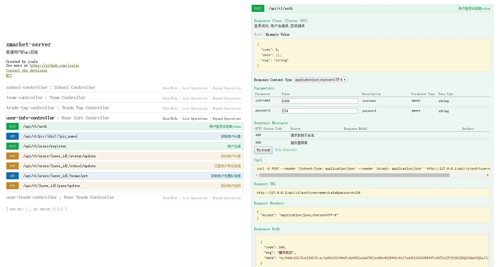

## xmarket APP的后端

#### swagger API文档


---
#### [APP端地址(https://github.com/jcalaz/xmarket)
> 基于MVP+RxJava+Retrofit+Dagger2+Realm的校园交易市场APP
---

### Server代码中的小实现
- [spring data mongo使用MongoTemplate实现复杂数据操作](https://github.com/jcalaz/xmarket-server/blob/master/src/main/java/me/jcala/xmarket/server/repository/CustomRepositoryImpl.java)
- [Multipart接收多多图片存储，并生成图片获取链接](https://github.com/jcalaz/xmarket-server/blob/master/src/main/java/me/jcala/xmarket/server/utils/FileTool.java)
- [使用SpringMVC拦截器验证Token是否过期和合法](https://github.com/jcalaz/xmarket-server/blob/master/src/main/java/me/jcala/xmarket/server/interceptor/TokenInterceptor.java)
- [swagger配置，自动根据springmvc的控制器注解生成API文档](https://github.com/jcalaz/xmarket-server/blob/master/src/main/java/me/jcala/xmarket/server/conf/RestConfig.java)
- [MongoRepository设置从mongo读取列](https://github.com/jcalaz/xmarket-server/blob/master/src/main/java/me/jcala/xmarket/server/repository/TradeRepository.java)
- [jwt token的创建](https://github.com/jcalaz/xmarket-server/blob/master/src/main/java/me/jcala/xmarket/server/repository/TradeRepository.java)
- [spring boot配置https](https://github.com/jcalaz/xmarket-server/blob/master/src/main/resources/application-dev.yml)

### APP代码中的小实现
- [fresco自定义ImagePipeline，使用OkHttp加载图片,并加入SSL访问证书](https://github.com/jcalaz/xmarket/blob/master/app/src/main/java/me/jcala/xmarket/app/App.java)
- [retrofit通过okHttp拦截器实现token验证，过期自动获取新token](https://github.com/jcalaz/xmarket/blob/master/app/src/main/java/me/jcala/xmarket/network/TokenInterceptor.java)
- [retrofit支持https访问](https://github.com/jcalaz/xmarket/blob/master/app/src/main/java/me/jcala/xmarket/network/ReqExecutor.java)
- [RecyclerView万能适配器](https://github.com/jcalaz/xmarket/blob/master/app/src/main/java/me/jcala/xmarket/view/RecyclerCommonAdapter.java)
- [retrofit http日志打印](https://github.com/jcalaz/xmarket/blob/master/app/src/main/java/me/jcala/xmarket/network/ReqExecutor.java)
- [结合RxJava实现的后台轮询](https://github.com/jcalaz/xmarket/blob/master/app/src/main/java/me/jcala/xmarket/mvp/message/MessageService.java)
- [MVP模式的实现](https://github.com/jcalaz/xmarket/tree/master/app/src/main/java/me/jcala/xmarket/mvp/school)
- [Dagger2实现简单依赖注入](https://github.com/jcalaz/xmarket/tree/master/app/src/main/java/me/jcala/xmarket/di)
- [Realm数据库实现页面数据存储](https://github.com/jcalaz/xmarket/blob/master/app/src/main/java/me/jcala/xmarket/mvp/sort/TradeTagPresenterImpl.java)
- [fresco加载gif，实现启动动画](https://github.com/jcalaz/xmarket/blob/master/app/src/main/java/me/jcala/xmarket/mvp/splash/SplashActivity.java)
- [fresco实现圆形头像](https://github.com/jcalaz/xmarket/blob/master/app/src/main/res/layout/main_slide.xml)
- [RxJava+retrofit实现HTTP访问](https://github.com/jcalaz/xmarket/blob/master/app/src/main/java/me/jcala/xmarket/mvp/school/SchoolModelImpl.java)
- [retrofit实现多图片和javabean同时上传](https://github.com/jcalaz/xmarket/blob/master/app/src/main/java/me/jcala/xmarket/mvp/trade/add/TradeAddModelImpl.java)


### 所用技术
- springboot
- springmvc: restful
- spring data mongo: mongo框架
- mongoDB: 数据库
- spring Fox: 生成API在线文档
- react.js: 后台管理ui
- shiro: 权限引擎

## 注意事项
- APP使用Androidtudio开发，后端采用idea。由于都使用了lombok，两个ide都需要安装lombok插件。
- fresco自定义了ImagePipeline，并且访问时加上了证书，所以只能加载本服务器的图片。
- 目前server的admin后台管理还没有完成，还没有进行mongo建立索引等优化。有时间会陆续加上。

### 其他配置

- 服务器端访问路径
  1. APP，在AppConf中配置BASE_URL为服务器访问路径
  2. server，在application.yml中配置xmarket.address为服务器访问路径
- 默认采用HTTPS协议，如果想使用http协议
  1. APP，将AppConf的enabled_ssl设置为false
  2. server，application.yml中将server.ssl.enabled设置为false

- 服务器图片存储物理路径：
- APP轮询频率：设置AppConf中的Message_Interval

- APP每页商品加载的条数：设置AppConf中的size

- 服务器图片存储路径： application.yml中设置xmarket.pic_home

### https证书使用keytool生成,生成命令
```
keytool -genkey -alias xmarketkey -keyalg RSA -keysize 1024 -keypass sdjkasl465sd -validity 365 -keystore g:\home\xmarket.keystore -storepass 546sdhjdf  //生成证书

keytool -list  -v -keystore g:\home\xmarket.keystore -storepass 546sdhjdf //查看证书

keytool -export -alias xmarketkey -keystore g:\home\xmarket.keystore -file g:\home\xmarket.crt -storepass 546sdhjdf //导出证书

keytool -printcert -file g:\home\xmarket.crt //查看证书

```
