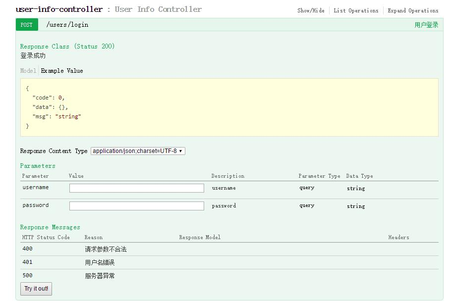
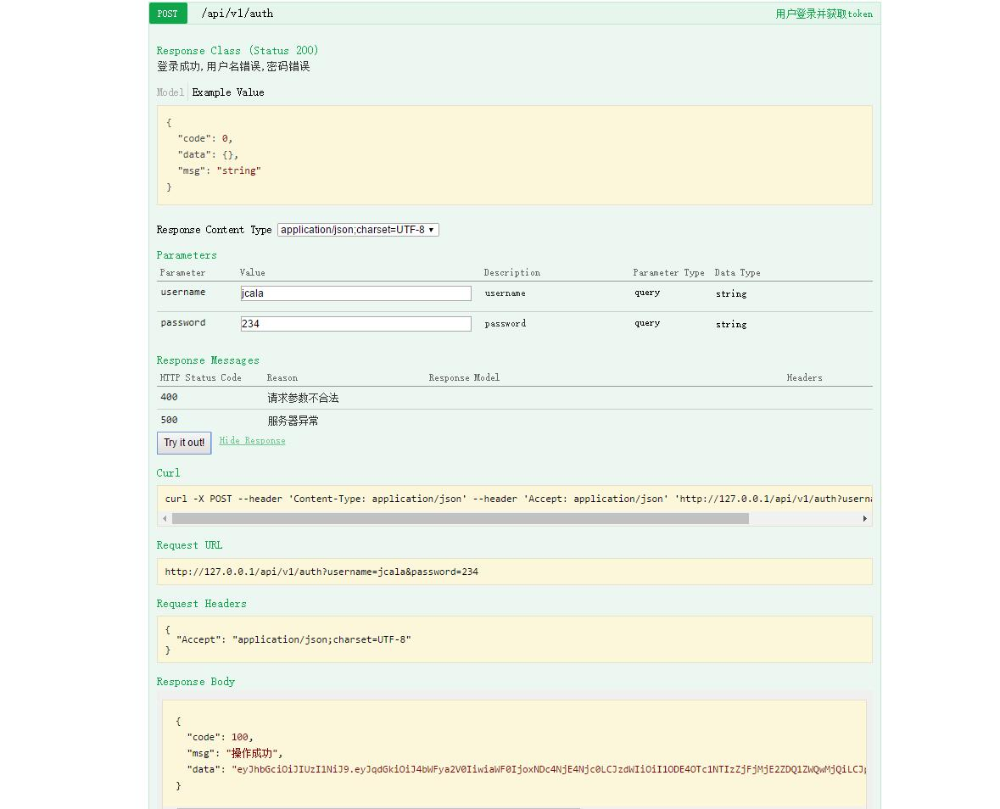

## xmarket APP的后端

####[APP端 https://github.com/jcalaz/xmarket](https://github.com/jcalaz/xmarket)

正在开发中。。。

### 所用技术

- springboot
- springmvc: restful
- spring data mongo: mongo框架
- mongoDB: 数据库
- spring Fox: 生成API在线文档
- react.js: 后台管理ui
- shiro: 权限引擎

#### swagger API文档





#### 特点

1. 符合restful风格,url基本符合HTTP的幂等性。只有注册等几个对幂等性要求不高的少数功能不符合
2. Token验证。
3. 用JWT作Token，无需session缓存token，降低服务器压力。
4. 支持HTTPS。
5. 后台使用react.js做单页面应用。
6. 返回状态码独立与HTTP状态码，针对不同情况返回不同自定义状态码和HTTP状态码。例如更新用户密码

```
PUT /users/user_id/update_pass               更新用户密码
更新成功:       自定义状态码100  HttpStatus200 content不包含内容
原密码错误:     自定义状态码204  HttpStatus200
jwt过期:        自定义状态码101  HttpStatus200
用户名不存在:   HttpStatus404
无操作权限:     HttpStatus403
操作异常:       HttpStatus500
参数错误:       HttpStatus400
jwt不合法:      HttpStatus401
```