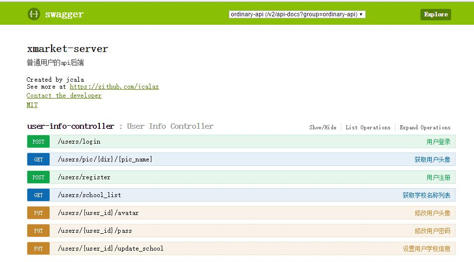

## xmarket APP的后端

正在开发中。。。

### 所用技术

- springboot
- springmvc: restful
- spring data mongo: mongo框架
- mongoDB: 数据库
- spring Fox: 生成API在线文档
- react.js: 后台管理ui
- shiro: 权限引擎

#### swagger API文档



#### 特点

1. 符合restful风格,url基本符合HTTP的幂等性。只有注册等几个对幂等性要求不高的少数功能不符合
2. 返回状态码独立与HTTP状态码，针对不同情况返回不同自定义状态码和HTTP状态码。例如登录就有以下状态码

    ```
    登录成功:   自定义状态码100  HttpStatus200
    用户名错误: 自定义状态码202  HttpStatus404
    密码错误:   自定义状态码203  HttpStatus401
    操作异常:   自定义状态码101  HttpStatus500
    参数错误:   自定义状态码103  HttpStatus400
    ```

3. Token验证。
4. 用JWT作Token，无需session缓存token，降低服务器压力。
5. 支持HTTPS。
6. 后台使用react.js做单页面应用。